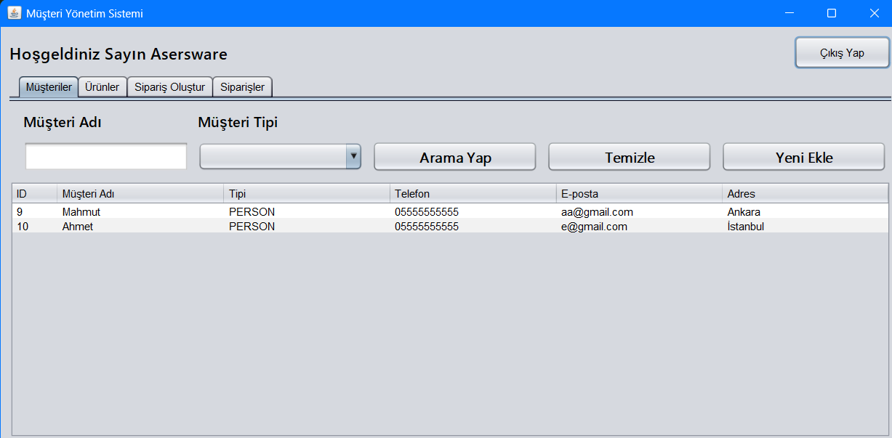
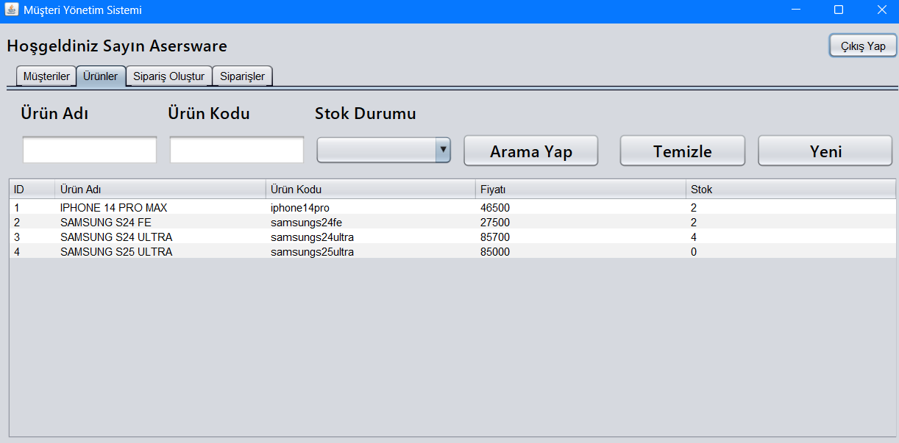
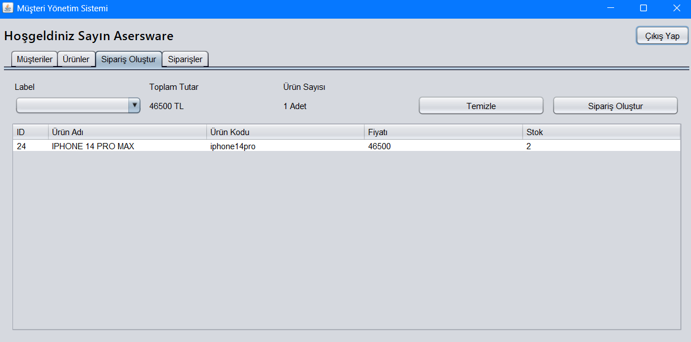
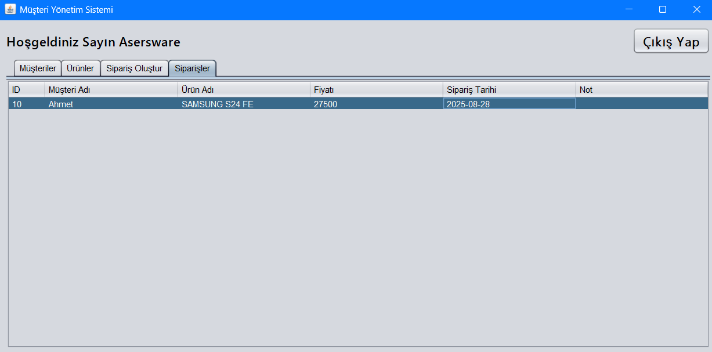

🛠️ Customer Management System

This project is a simple Customer Management System (CMS) application developed to facilitate customer and product management.
Users can manage customers and products, and also create orders through the cart system.

🚀 Features

Customer Management

List customers

Add new customer

Update customer

Delete customer

Filter by name and customer type

Product Management

List products

Add new product

Update product

Delete product

Filter by name, code, and stock status

Cart & Order System

Add products to the cart

Create an order

🖥️ Technologies Used

Java (Swing & JDBC)

HeidiSQL database

📷 Screenshots

 
  
  
  

